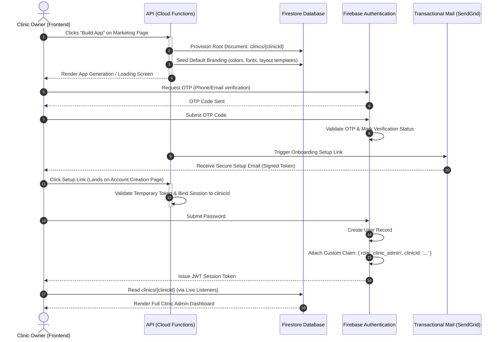
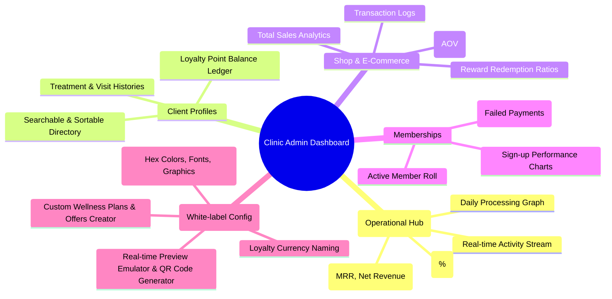
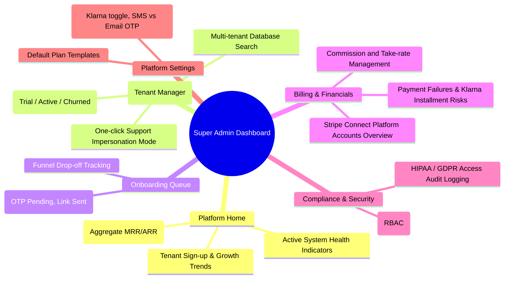

# 🩺 Aurwell

> **Enterprise Multi-Tenant Clinic Patient & Loyalty Platform**  
> A premium solution for aesthetic clinics across the USA & Europe. Positioned as the ultimate competitor to Dermis.

---

## 🏗️ System Architecture & Data Isolation

Aurwell operates on a **"Clinic-First" multi-tenant architecture**. All assets, patients, transactions, and configurations are securely isolated at the database level using a single-database, multi-tenant hierarchy in Firebase/Firestore, protected by Custom JWT Auth Claims and Firestore Security Rules.

```mermaid
graph TD
    %% Styling
    classDef platform fill:#6366f1,stroke:#4f46e5,color:#fff,stroke-width:2px;
    classDef tenant fill:#f97316,stroke:#ea580c,color:#fff,stroke-width:2px;
    classDef client fill:#10b981,stroke:#059669,color:#fff,stroke-width:2px;

    %% Platform Super Admin
    SA[Super Admin Panel]:::platform -->|Global Queries| Firestore[(Firestore DB)]
    SA -->|Manage Payouts| Stripe[Stripe Connect]

    %% Tenant Isolation
    subgraph Tenant Isolation Boundary [clinics/{clinicId}]
        Firestore --> ClinicDoc[Clinic Document: Settings & Brand Configuration]:::tenant
        ClinicDoc --> SubColl1[patients]:::tenant
        ClinicDoc --> SubColl2[memberships]:::tenant
        ClinicDoc --> SubColl3[transactions]:::tenant
        ClinicDoc --> SubColl4[treatments]:::tenant
    end

    %% Access Layer
    ClinicAdmin[Clinic Admin Panel]:::tenant -->|Access scoped strictly by clinicId Claim| ClinicDoc
    PatientApp[White-Labeled Patient App]:::client -->|Read-only branding / Read-write own profile| ClinicDoc
```

---

## 🚀 Sign-Up ➔ App-Build ➔ Dashboard Onboarding Flow

When a clinic registers and initiates their app generation, they follow an automated, secure onboarding funnel. The diagram below details the interaction between the **Frontend (what the clinic sees)** and the **Backend (what happens behind the scenes)**.



---

## 🎛️ Two-Tier Admin Panel Specifications

Aurwell features two completely separate, highly specialized dashboard panels operating on top of the same unified backend infrastructure.

### 1. Clinic Admin Panel (Tenant Level)
*Scope: Read/write access restricted entirely to the owner's `clinicId`.*



### 2. Super Admin Panel (Platform Owner Level)
*Scope: Global view across all clinic tenants for platform operations, growth monitoring, and support.*



---

## 🔒 Security, Compliance, & Tenant Isolation Rules

To safely serve clinics in the US and Europe, Aurwell is architected to exceed standard security baselines:

1. **HIPAA & GDPR Ready**: All PHI (Protected Health Information) stored within `clinics/{clinicId}/patients` is encrypted at rest. Action logs record every instance of patient data access for strict auditing.
2. **Deterministic Database Rules**: Database separation is not handled at the UI layer. Firestore Rules validate the user's custom JWT claim (`request.auth.token.clinicId`) against the path of the document they are accessing:
   ```javascript
   match /clinics/{clinicId}/{document=**} {
     allow read, write: if request.auth != null && request.auth.token.clinicId == clinicId;
   }
   ```
3. **High-Frequency Ephemeral Data**: To optimize database costs and delivery speeds, live clinic queues and patient check-in statuses are routed through **Firebase Realtime Database** rather than Firestore.

---

## 🛠️ Local Development & Setup

### Prerequisites
- Node.js v18+ / v20+
- Firebase CLI (`npm install -g firebase-tools`)

### Getting Started

1. **Clone & Install Dependencies**:
   ```bash
   npm install
   ```

2. **Configure Environment Variables**:
   Copy `.env.local.example` to `.env.local` and add your Firebase credentials:
   ```bash
   cp .env.local.example .env.local
   ```

3. **Run the Development Server**:
   ```bash
   npm run dev
   ```
   Open [http://localhost:3000](http://localhost:3000) to view the client app.

4. **Run Firebase Emulators (Optional Local Development)**:
   To test Firestore rules and database operations locally without touching production:
   ```bash
   firebase emulators:start
   ```
   The Emulator Suite UI will be available at [http://localhost:4000](http://localhost:4000).
