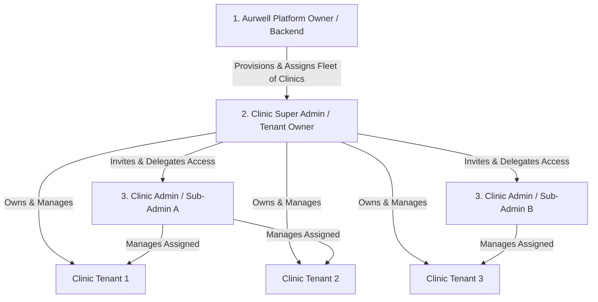
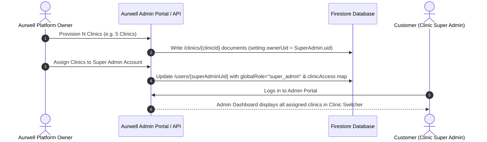
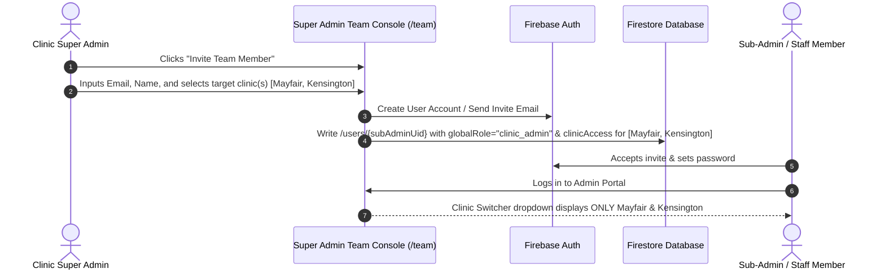

# 🏛️ Future Multi-Tenant & Multi-Admin Architecture

This document defines the official 3-tier Role-Based Access Control (RBAC) and multi-clinic management flow for the Aurwell platform.

---

## 📐 1. System Role Hierarchy (3-Tier Model)



### Roles Breakdown

| Role Level | Title | Who Assigns It? | Scope & Capabilities |
|---|---|---|---|
| **Level 1** | **Platform Owner** *(Aurwell Core)* | Platform Backend / System | Full root system access. Creates new clinic tenant documents, provisions multi-clinic packages (e.g. 5, 10, or 100 clinics), and assigns ownership to a customer (`Clinic Super Admin`). |
| **Level 2** | **Clinic Super Admin** *(Tenant Owner)* | Platform Owner | Owns and oversees all assigned clinics. Can switch between all owned clinics, manage clinic-wide billing, and invite/manage **Sub-Admins**. |
| **Level 3** | **Clinic Admin / Sub-Admin** *(Branch Manager / Staff)* | Clinic Super Admin | Assigned by the Super Admin to specific clinic(s). Can only view, switch between, and manage the clinic(s) explicitly delegated to them. |

---

## 🗄️ 2. Firestore Data Model & Schema Updates

To support this 3-tier flow with maximum performance (1 read on login) and future scalability, user documents store a `globalRole` and a `clinicAccess` map.

### `/users/{uid}` Collection

#### A. Platform Owner Document (Level 1)
```json
{
  "uid": "PLATFORM_OWNER_UID",
  "email": "admin@aurwell.com",
  "firstName": "Aurwell",
  "lastName": "Platform Admin",
  "globalRole": "platform_admin",
  "createdAt": "timestamp"
}
```

#### B. Clinic Super Admin Document (Level 2 — Tenant Owner with 3 Clinics)
```json
{
  "uid": "SUPER_ADMIN_UID_101",
  "email": "sarah@beautychain.com",
  "firstName": "Dr. Sarah",
  "lastName": "Jenkins",
  "globalRole": "super_admin",
  "defaultClinicId": "clinic_mayfair",
  
  // 🔑 All clinics assigned to this Super Admin by Aurwell Platform
  "clinicAccess": {
    "clinic_mayfair": {
      "role": "super_admin",
      "merchantName": "Mayfair Aesthetics",
      "permissions": ["all"]
    },
    "clinic_soho": {
      "role": "super_admin",
      "merchantName": "Soho Beauty Bar",
      "permissions": ["all"]
    },
    "clinic_kensington": {
      "role": "super_admin",
      "merchantName": "Kensington Clinic",
      "permissions": ["all"]
    }
  },
  "createdAt": "timestamp"
}
```

#### C. Clinic Admin / Sub-Admin Document (Level 3 — Branch Manager)
```json
{
  "uid": "SUB_ADMIN_UID_202",
  "email": "alex@beautychain.com",
  "firstName": "Alex",
  "lastName": "Rivera",
  "globalRole": "clinic_admin",
  "defaultClinicId": "clinic_mayfair",
  "invitedBy": "SUPER_ADMIN_UID_101",
  
  // 🔑 Only clinics explicitly delegated by the Super Admin
  "clinicAccess": {
    "clinic_mayfair": {
      "role": "clinic_admin",
      "merchantName": "Mayfair Aesthetics",
      "permissions": ["manage_treatments", "manage_memberships", "view_clients"]
    }
    // Note: clinic_soho & clinic_kensington are omitted (zero access)
  },
  "createdAt": "timestamp"
}
```

---

## 🔄 3. End-to-End Operational Workflows

### Workflow 1: Platform Owner Assigns Clinics to a Super Admin



---

### Workflow 2: Super Admin Invites & Delegates Access to Sub-Admins



---

## 🔒 4. Firestore Security Rules Matrix

The Firestore rules enforce strict 3-tier boundary checks:

```javascript
rules_version = '2';

service cloud.firestore {
  match /databases/{database}/documents {

    // Helper: Fetch current user data
    function getUserData() {
      return get(/databases/$(database)/documents/users/$(request.auth.uid)).data;
    }

    // Helper: Check if current user is Platform Owner
    function isPlatformAdmin() {
      return request.auth != null && getUserData().globalRole == "platform_admin";
    }

    // Helper: Check if current user has access to a specific clinic
    function hasClinicAccess(clinicId) {
      let userData = getUserData();
      return request.auth != null && (
        userData.globalRole == "platform_admin" ||
        (userData.clinicAccess != null && userData.clinicAccess[clinicId] != null)
      );
    }

    // Helper: Check if user is Super Admin of a clinic
    function isClinicSuperAdmin(clinicId) {
      let userData = getUserData();
      return request.auth != null && (
        userData.globalRole == "platform_admin" ||
        (userData.clinicAccess != null && 
         userData.clinicAccess[clinicId] != null && 
         userData.clinicAccess[clinicId].role == "super_admin")
      );
    }

    // ── Users Collection ───────────────────────────────────
    match /users/{userId} {
      allow read: if request.auth != null;
      // Users update their own profile; Super Admins can update Sub-Admin permissions
      allow write: if request.auth.uid == userId || isPlatformAdmin() || request.auth != null;
    }

    // ── Clinics & Subcollections ───────────────────────────
    match /clinics/{clinicId} {
      allow read: if hasClinicAccess(clinicId);
      allow write: if isClinicSuperAdmin(clinicId);

      match /{allSubcollections=**} {
        allow read, write: if hasClinicAccess(clinicId);
      }
    }
  }
}
```

---

## 🎨 5. Admin Panel UI Components & Interactions

### A. Clinic Switcher Header (`apps/admin/src/app/(dashboard)/layout.tsx`)
- Reads `userDoc.data().clinicAccess`.
- Displays currently selected clinic with logo & name.
- Dropdown items:
  - List of accessible clinics (filtered per user).
  - For **Platform Owner / Super Admin**: Displays **"+ Provision / Link Clinic"**.
  - For **Sub-Admins**: Displays assigned clinics only.

### B. Team Management Console (`apps/admin/src/app/(dashboard)/team/page.tsx`)
- Visible to **Super Admins**.
- Table showing all invited team members, their assigned clinics, and roles.
- Modal to edit clinic access assignments (add or revoke clinic access dynamically).

---

## 💡 Summary of Benefits

1. **Platform Owner Control**: You assign clinic packages (1, 10, 100 clinics) to tenant Super Admins from your side.
2. **Delegated Administration**: Super Admins self-manage their sub-admins without calling support.
3. **Zero Impact on Mobile Patient App**: Data paths `/clinics/{clinicId}/...` remain 100% untouched and fully backward-compatible.
4. **Single Read Performance**: User login loads profile + all allowed clinic IDs in 1 document fetch.
